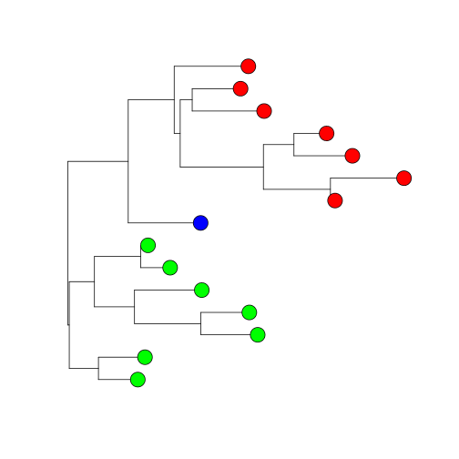
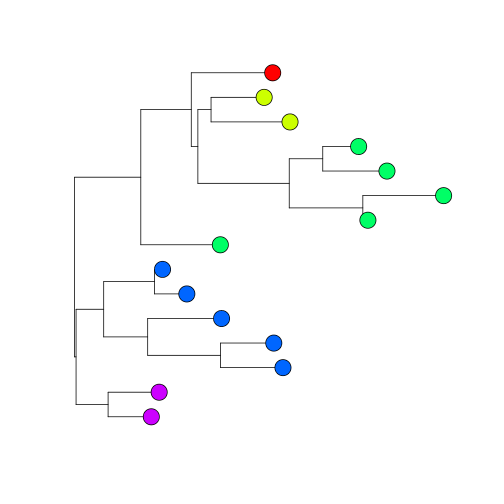

add.tip.icons - plot species trait data on a non-ultrametric phylogeny
========================================================

This function will plot discrete data at the tips of a non-ultrametric phylogeny
The supporting data are: function code, phylogeny, and data.

The arguments to pass to the function are:
* `phy` - A phylogeny of class `phylo`
* `data` -  A `data.frame` where the data to be plotted is contained
* `plot.data` - The name of the column in the `data.frame` to be plotted
* `pch` - `numeric` value for the plotting symbol to be used
* `cols` - `character` string specifying the colors to be used in plotting. There must be one color for every unique `plot.data` value
* `cex` - Size of the symbols

First load the example data provided

```r
data <- read.csv("data.csv")

require(ape)
```

```
## Loading required package: ape
```

```r
phy <- read.nexus("phy.nex")

source("add.tip.icons.R")
```

In this first example, we will plot the `Location` data. Here, there are three states to be plotted (1, 2 & 3), which will be represented by the colors red, blue & green in that order.


```r
add.tip.icons(phy, data, grouping="Species", plot.data = "Location", cex=3)
```

 


Changing `pch` changes the plotting symbol. When a value above 20 is used, the specified colors wil change the background color (as above). When the `pch` value is 20 or lower, the overall color of the symbol will be changed (see `?pch` for more information), for example:


```r
add.tip.icons(phy, data, cex=3, pch=15)
```

 

Next, we will plot the `size` data. Now there are five states present, meaning that additional colors must be specified.


```r
add.tip.icons(phy, data, grouping = "Species", plot.data="Size", cols=rainbow(5), cex=3)
```

 


