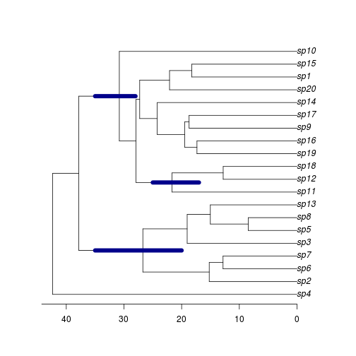

Add HPD Info - Add probability density information into phylogenies
========================================================
This function is a precursor for the `HPDbars` function in the package `phyloch`. The function will, given a phylogeny and node information, combine the data which can then be passed to the `HPDbars` function. The aim here is to show the results at a selection of nodes, rather than all the nodes in the phylogeny.

This function requires that the package `phyloch` package be loaded.

```r
library(phyloch)
```

```
## Loading required package: ape
## Loading required package: colorspace
## Loading required package: XML
```

First we must load the file containing the function to be used, and load the example phylogeny.

```r
source("add_HPD_info.R")
phy <- read.nexus("example.phylo.nex")
```

Next, we will generate some data to be plotted onto our phylogeny:

```r
# This function requires that "node", "min" and "max" appear in the column names in some form
node_ages <- as.data.frame(matrix(NA, ncol=3, nrow=3))
colnames(node_ages) <- c("node", "Minimum", "Maximum")
node_ages[,1] <- c("23", "31", "29")
node_ages[,2] <- c(20, 17, 28)
node_ages[,3] <- c(35, 25, 35)

node_ages
```

```
##   node Minimum Maximum
## 1   23      20      35
## 2   31      17      25
## 3   29      28      35
```

Now we will run the function, creating a new object of class `phylo'

```r
phy.full <- add_HPD_info(phy, node_ages)
```

You can see the information that has been added in the following manner:

```r
str(phy.full)
```

```
## List of 6
##  $ edge              : int [1:38, 1:2] 21 21 22 23 24 24 25 25 23 26 ...
##  $ edge.length       : num [1:38] 42.38 4.53 11.12 11.51 15.22 ...
##  $ Nnode             : int 19
##  $ tip.label         : chr [1:20] "sp1" "sp2" "sp3" "sp4" ...
##  $ height_95%_HPD_MIN: num [1:19] NA NA 20 NA NA NA NA NA 28 NA ...
##  $ height_95%_HPD_MAX: num [1:19] NA NA 35 NA NA NA NA NA 35 NA ...
##  - attr(*, "class")= chr "phylo"
##  - attr(*, "order")= chr "cladewise"
```

This new phylogeny can then be passed to `HPDbars`. 


```r
plot(phy.full)
axisPhylo()
HPDbars(phy.full, col="darkblue", lwd=8)
```

 


